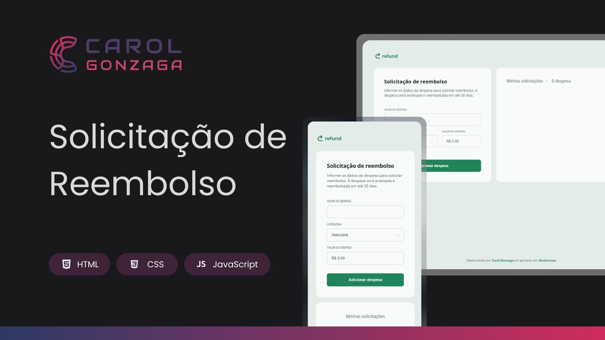

  

 

Uma aplicação de controle de reembolsos com abordagem totalmente responsiva.

  <a href="#-tecnologias">Tecnologias</a>&nbsp;&nbsp;&nbsp;|&nbsp;&nbsp;&nbsp;<a href="#-objetivo">Objetivo</a>&nbsp;&nbsp;&nbsp;|&nbsp;&nbsp;&nbsp;<a href="https://carolgonzaga.github.io/refund-reembolso/">Acesse o Projeto</a>

 
 

  

 
 

## 🚀 Tecnologias

Esse projeto foi desenvolvido com as seguintes tecnologias:

- HTML5
- CSS3 (com variáveis e media queries)
- JavaScript (manipulação do DOM)

 
 

## 🎯 Objetivo

O objetivo deste projeto é praticar a manipulação de elementos HTML com JavaScript.

 

A aplicação permite que o usuário:

- Adicione novas solicitações de reembolso
- Selecione uma categoria para cada despesa
- Informe o valor da despesa com formatação automática (R$)
- Visualize o total de reembolsos adicionados
- Remova itens da lista com apenas um clique
- Tenha uma experiência fluida em diferentes tamanhos de tela
